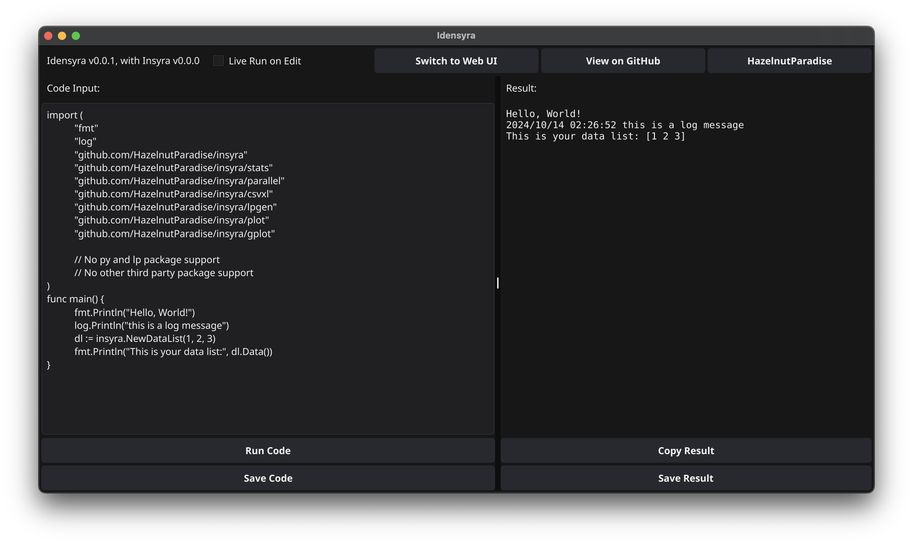
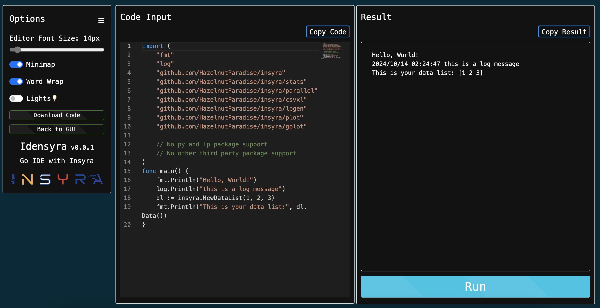

# Idensyra

`Idensyra` is a mini Go IDE, with [Insyra](https://github.com/HazelnutParadise/insyra) pre-installed. Run Go code without installing Go environment!

**Official Website: https://insyra.hazelnut-paradise.com/#HowToUse**

**Get Idensyra executable file [HERE](https://github.com/HazelnutParadise/idensyra/releases).**

## [Insyra](https://github.com/HazelnutParadise/insyra) Inside: Simple? It's quite!

With `Idensyra`, you can write Go code, and run it immediately, no need to install Go environment. Also, you can use [Insyra](https://github.com/HazelnutParadise/insyra)'s functions directly in `Idensyra`.

## User Interface

Idensyra has two modes:

- **GUI mode**: Build with [Fyne](https://github.com/fyne-io/fyne), supports live run.
- **WebUI mode**: WebUI with [monaco-editor](https://github.com/microsoft/monaco-editor), provides code highlighting and auto-complete.

### GUI

### WebUI

## How it works

Idensyra use [Yaegi](https://github.com/traefik/yaegi) to run Go code.

## Limitation

- No third party package support (except Insyra and its dependencies).
- Does not support `py` and `lp` package of Insyra.
- Currently no code highlighting.
