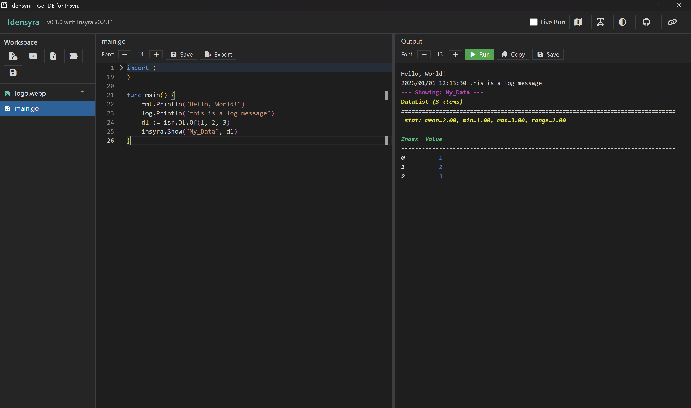
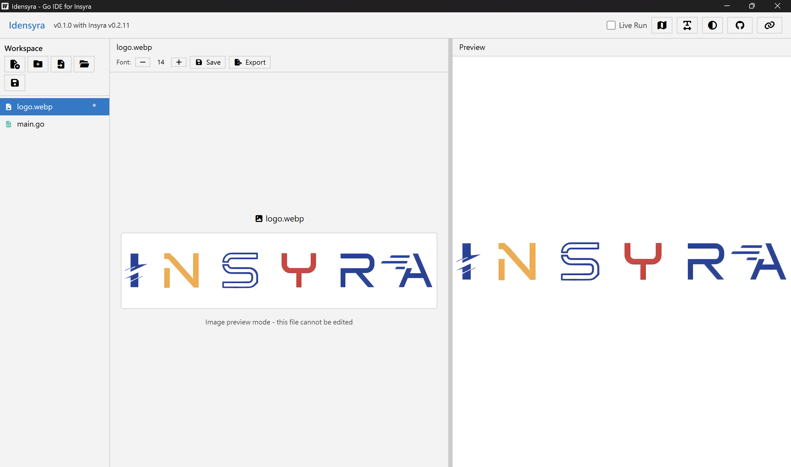
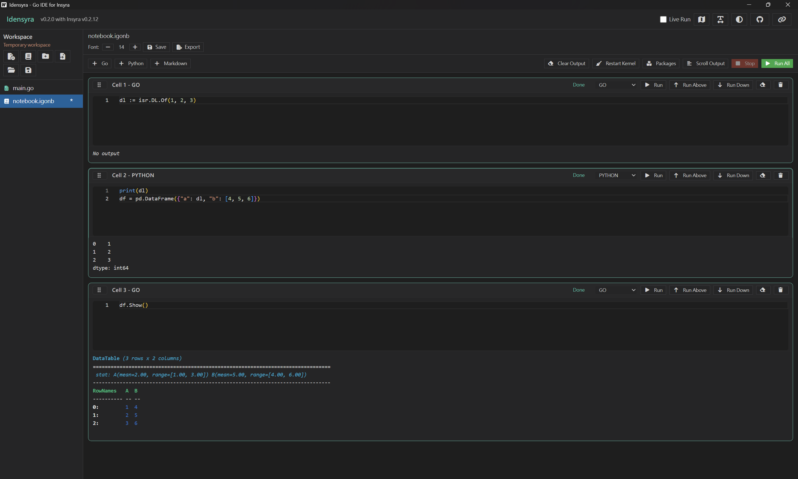

# Idensyra

**Idensyra** 是一個基於 Wails v2 的跨平台 Go 代碼編輯器與執行環境，專為 [Insyra](https://insyra.hazelnut-paradise.com) 數據科學庫設計。





## 特性

### 核心功能

- 即時執行：使用 Yaegi 解釋器即時執行 Go 代碼，無需編譯
- Monaco Editor：集成 VS Code 同款編輯器，提供語法高亮與智慧提示
- Insyra 集成：完整支援 Insyra 與 Go 標準庫
- Live Run 模式：編輯時自動執行（防抖）
- 多語言檔案支援：常見程式與文件格式皆可高亮顯示
- 跨平台、輕量：Windows/macOS/Linux，使用系統 WebView
- 完全本地化：所有前端資源本地打包，離線可用

### igonb Notebook（v0.2.0 新增）



- `.igonb` 格式：類似 Jupyter 的互動式筆記本
- 多語言 Cell：支援 Go、Python、Markdown
- 靈活執行：單一 Cell 執行、與上方 Cell 一起執行、向下執行全部
- Cell 管理：拖放排序、新增、刪除、摺疊
- Markdown 即時預覽
- 執行控制：停止執行、重置環境
- 輸出模式：Full（完整顯示）/ Compact（精簡顯示）切換
- 自動保存編輯內容

### Python 支援（v0.2.0 新增）

- 執行 `.py` 檔案
- 內建 Python 套件管理器（pip list/install/uninstall）
- 可重新安裝 Python 環境
- Go-Python 互操作：在 igonb 中共享變數

### IPython Notebook 支援（v0.2.0 新增）

- 開啟 `.ipynb` 檔案並預覽
- 一鍵轉換 `.ipynb` 到 `.igonb` 格式

### MCP Server（v0.2.1 新增）

- 提供 Model Context Protocol (MCP) 服務器接口
- 允許 AI 代理與 Idensyra 工作區交互
- 文件操作：讀取、寫入、創建、刪除、重命名文件
- 代碼執行：執行 `.go` 和 `.py` 文件
- Notebook 操作：修改、插入、執行儲存格
- 工作區管理：打開、保存工作區，保存未保存的更改
- 可配置的權限系統：用戶可決定是否需要確認每個操作
- 詳見 [mcp/README.md](mcp/README.md)

### 工作區與檔案

- 啟動即建立臨時工作區，可建立/開啟工作區資料夾以持久保存
- 多檔案與資料夾樹狀管理，支援建立/重新命名/刪除
- 檔案拖放移動與排序
- 匯入外部檔案（任意格式），匯出目前檔案到指定位置
- 自動暫存：編輯後約 1 秒同步到工作區暫存區
- 檔案修改與大型檔案提示（`*` 與 `L` 標示）
- 二進位或過大的檔案以預覽模式呈現，避免誤編輯

### 編輯器功能

- Undo/Redo、多游標、程式碼摺疊、括號配對
- Minimap / 自動換行一鍵切換
- Go 智慧提示：標準庫、Insyra 函式與 struct 成員
- 編輯器與輸出區字體大小調整

### 預覽與輸出

- HTML/Markdown/CSV/TSV 即時預覽（輸出面板）
- Excel (`.xlsx`/`.xlsm`/`.xltx`/`.xltm`) 表格預覽與工作表切換
- 圖片/影片/音訊/PDF 預覽
- ANSI 彩色輸出，深淺主題皆清晰可讀

### 主題與體驗

- 跟隨系統深/淺色，也可手動切換
- 操作通知與匯入/開啟進度提示

## 系統要求

### 開發環境

- Go 1.25 或更高版本
- Node.js 16 或更高版本（或 Bun）
- Wails CLI v2.11.0 或更高版本

### 運行環境

- **Windows**: Windows 10/11，需要 WebView2 Runtime
- **macOS**: macOS 10.13 或更高版本
- **Linux**: 需要 WebKitGTK

## 快速開始

### 安裝 Wails CLI

```bash
go install github.com/wailsapp/wails/v2/cmd/wails@latest
```

### 克隆項目

```bash
git clone https://github.com/HazelnutParadise/idensyra.git
cd idensyra
```

### 安裝依賴

```bash
# 安裝 Go 依賴
go mod download

# 安裝前端依賴
cd frontend
npm install  # 或 bun install
cd ..
```

### 開發模式

啟動開發服務器（支持熱重載）：

```bash
wails dev
```

### 構建生產版本

```bash
wails build
```

構建完成後，可執行文件位於 `build/bin/` 目錄。

## 使用方法

### 基本操作

1. **建立或開啟工作區**
   - 工作區工具列提供 New File、New Folder、Import、Open Workspace、Save All
2. **編寫與管理檔案**
   - 左側檔案樹點擊切換
   - 檔案或資料夾右側 `...` 選單可重新命名/刪除
   - 拖放檔案可移動位置
3. **儲存**
   - `Ctrl/Cmd + S` 儲存目前檔案
   - `Ctrl/Cmd + Shift + S` 儲存全部
   - 臨時工作區會提示建立工作區資料夾
4. **執行與預覽**
   - `.go` 檔案可 Run 或 `Ctrl/Cmd + Enter`
   - `.py` 檔案可直接執行
   - `.igonb` 檔案以 Notebook 模式顯示
   - HTML/Markdown/CSV/TSV/Excel/媒體檔會顯示預覽
5. **匯出與輸出保存**
   - Export 會將目前檔案輸出到指定位置
   - Output 的 Save 會將結果寫入工作區（`result.txt` 或 `result_#.txt`）

### igonb Notebook 使用

1. **建立 Notebook**
   - 點擊工具列的 Notebook 按鈕建立 `.igonb` 檔案
2. **Cell 操作**
   - 點擊 Cell 選擇，使用語言選擇器切換 Go/Python/Markdown
   - `▶` 執行單一 Cell
   - `▲▶` 執行目前及上方所有 Cell
   - `▼▶` 從目前 Cell 向下執行全部
   - `+` 新增 Cell，`×` 刪除 Cell
   - 拖動 Cell 左側把手可排序
3. **執行控制**
   - Run All 執行所有 Cell
   - Stop 停止執行
   - Reset 重置環境（清除變數與狀態）
4. **Go-Python 互操作**
   - 在 Go Cell 中定義的變數可在 Python Cell 中使用
   - 支援基本型別與 Insyra DataList/DataTable

### Python 套件管理

1. 點擊工具列的 Python 按鈕開啟套件管理器
2. 可查看已安裝套件、安裝新套件、解除安裝套件
3. 如遇問題可重新安裝 Python 環境

### 快捷鍵

| 功能         | Windows/Linux                    | macOS                          |
| ------------ | -------------------------------- | ------------------------------ |
| 執行程式碼   | `Ctrl + Enter`                   | `Cmd + Enter`                  |
| 儲存目前檔案 | `Ctrl + S`                       | `Cmd + S`                      |
| 儲存全部     | `Ctrl + Shift + S`               | `Cmd + Shift + S`              |
| 新增檔案     | `Ctrl + N`                       | `Cmd + N`                      |
| 復原         | `Ctrl + Z`                       | `Cmd + Z`                      |
| 重做         | `Ctrl + Shift + Z` 或 `Ctrl + Y` | `Cmd + Shift + Z` 或 `Cmd + Y` |
| 自動完成     | `Ctrl + Space`                   | `Ctrl + Space`                 |

### 工具列功能

**標題列右側按鈕（由左至右）：**

1. **Live Run** - 啟用/停用自動執行
2. **Minimap** - 切換程式碼縮略圖
3. **Word Wrap** - 切換換行模式
4. **Theme** - 切換深色/淺色主題
5. **Python** - 開啟 Python 套件管理器
6. **GitHub** - 開啟專案 GitHub 頁面
7. **Insyra 官網** - 開啟 Insyra 官方網站

**工作區側邊欄：**

- **New File** - 建立新檔案（`Ctrl/Cmd + N`）
- **New Notebook** - 建立新的 igonb 筆記本
- **New Folder** - 建立資料夾
- **Import File** - 匯入外部檔案到工作區
- **Open Workspace** - 開啟現有工作區資料夾
- **Save All** - 儲存所有檔案（`Ctrl/Cmd + Shift + S`）
- **... 選單** - 重新命名/刪除
- **`*` 指示器** - 檔案已修改
- **`L` 指示器** - 大型檔案（預覽模式）

**編輯器區域：**

- **Font +/-** - 調整字體大小（8-32px）
- **Save** - 儲存目前檔案（`Ctrl/Cmd + S`）
- **Export** - 匯出目前檔案到指定位置

**輸出區域：**

- **Run** - 執行程式碼（`.go` 或 `.py`）
- **Copy** - 複製輸出內容到剪貼簿
- **Save** - 將輸出結果寫入工作區檔案

**igonb Notebook 工具列：**

- **Run All** - 執行所有 Cell
- **Stop** - 停止執行
- **Reset** - 重置執行環境
- **Clear All** - 清除所有輸出
- **Full/Compact** - 切換輸出顯示模式
- **Convert** - 轉換 .ipynb 到 .igonb（僅 .ipynb 檔案）

### Live Run 模式

啟用 Live Run 後，`.go` 檔案會在您編輯時自動執行（約 1 秒防抖）。

### 編輯器設定

- **字體大小**: 使用 +/- 按鈕調整（8-32px）
- **Minimap**: 點擊工具列按鈕開啟/關閉
- **Word Wrap**: 點擊工具列按鈕切換換行/捲動模式
- **設定保存**: 主題、Minimap、Word Wrap 會保存並在下次啟動時恢復

## 示例代碼

### Go 程式碼

```go
import (
    "fmt"
    "log"

    "github.com/HazelnutParadise/insyra"
    "github.com/HazelnutParadise/insyra/isr"
)

func main() {
    fmt.Println("Hello, World!")
    log.Println("this is a log message")
    dl := isr.DL.Of(1, 2, 3)
    insyra.Show("My_Data", dl)
}
```

### igonb Notebook 範例

```json
{
  "version": 1,
  "cells": [
    {
      "language": "go",
      "source": "data := isr.DL.Of(1, 2, 3, 4, 5)\nfmt.Println(\"Sum:\", data.Sum())"
    },
    {
      "language": "python",
      "source": "print(f\"Data from Go: {data}\")"
    },
    {
      "language": "markdown",
      "source": "## 分析結果\n這是一個簡單的數據分析範例。"
    }
  ]
}
```

## 支持的包

Idensyra 支持以下 Insyra 子包：

- `insyra`: 核心數據結構
- `insyra/isr`: 數據列表和數據表操作
- `insyra/stats`: 統計分析
- `insyra/plot`: 數據可視化
- `insyra/gplot`: 高級繪圖
- `insyra/datafetch`: 數據獲取
- `insyra/csvxl`: CSV/Excel 處理
- `insyra/parquet`: Parquet 讀寫
- `insyra/mkt`: 市場數據工具
- `insyra/parallel`: 並行計算
- `insyra/lpgen`: 線性規劃
- `insyra/py`: Python 互操作

以及完整的 Go 標準庫支援。其他第三方套件目前不支援。

## 項目結構

```
idensyra/
├── app.go                 # Wails 應用後端邏輯
├── workspace.go           # 工作區與檔案管理
├── igonb_exec.go          # igonb 執行器綁定
├── python_exec.go         # Python 檔案執行
├── python_packages.go     # Python 套件管理
├── main.go                # 應用入口點
├── version.go             # 版本資訊
├── wails.json             # Wails 配置文件
├── go.mod                 # Go 模塊定義
├── igonb/                 # igonb 核心模組
│   ├── igonb.go           # Notebook 結構與解析
│   ├── runner.go          # 執行器管理
│   ├── execute.go         # Cell 執行邏輯
│   ├── python_bridge.go   # Go-Python 互操作
│   └── ...
├── internal/              # Yaegi 符號表
│   ├── ansi2html.go       # ANSI 轉 HTML
│   ├── extract.go         # 符號提取
│   └── github_com-*.go    # 提取的符號表
├── frontend/              # 前端代碼
│   ├── src/
│   │   ├── main.js        # 主 JavaScript 文件
│   │   └── style.css      # 樣式表
│   ├── index.html         # HTML 入口
│   ├── package.json       # 前端依賴
│   ├── vite.config.js     # Vite 配置
│   └── wailsjs/           # Wails 生成的綁定
└── build/                 # 構建輸出
    └── bin/
        └── idensyra.exe
```

## 開發指南

### 重新生成 Yaegi 符號表

如果 Insyra 包更新，需要重新生成符號表：

```bash
cd internal
go generate
```

### 前端開發

```bash
cd frontend
npm run dev      # 開發服務器
npm run build    # 構建生產版本
```

### 構建選項

```bash
# 默認構建（當前平台）
wails build

# 跨平台構建
wails build -platform darwin/amd64   # macOS
wails build -platform linux/amd64    # Linux
wails build -platform windows/amd64  # Windows

# 壓縮構建
wails build -upx

# 調試構建
wails build -debug
```

## 技術架構

### 前端

- **框架**: Vanilla JavaScript + Vite
- **編輯器**: Monaco Editor v0.55.1（本地化）
- **UI 框架**: Bootstrap v5.3.8（本地化）
- **圖標**: Font Awesome v7.1.0（本地化）
- **Markdown**: marked.js

### 後端

- **框架**: Wails v2.11.0
- **解釋器**: Yaegi v0.16.1
- **核心庫**: Insyra v0.2.12
- **試算表預覽**: Excelize v2.10.0
- **Python 互操作**: Insyra py 模組

## 更新日誌

### v0.2.0 (開發中)

- 新增 igonb Notebook 格式（類似 Jupyter）
- 支援 Go、Python、Markdown 多語言 Cell
- 新增 Python 檔案執行功能
- 新增 Python 套件管理器
- 支援 Go-Python 互操作（共享變數）
- 支援開啟與轉換 .ipynb 檔案
- 新增檔案拖放移動功能
- 更新 Insyra 至 v0.2.12
- 更新 Go 至 1.25

### v0.1.0 (2026-01-01)

- 新增工作區資料夾模式（建立/開啟/儲存）
- 支援資料夾樹與檔案重新命名
- 新增檔案預覽：HTML/Markdown/CSV/TSV/Excel/媒體
- 輸出結果可直接儲存到工作區
- Go 智慧提示強化（Insyra/標準庫/struct 成員）
- 完全本地化前端資源，支援離線使用

## 文檔

- **[README.md](README.md)** - 主要說明文件（本文件）
- **[CHANGELOG.md](CHANGELOG.md)** - 版本更新日誌
- **[FEATURES.md](FEATURES.md)** - 完整功能總覽（中文）
- **[QUICK_REFERENCE.md](QUICK_REFERENCE.md)** - 快速參考指南（中文）
- **[CONTRIBUTING.md](CONTRIBUTING.md)** - 貢獻指南
- **[LICENSE](LICENSE)** - MIT 授權條款

## 許可證

本項目採用 MIT 許可證。詳見 [LICENSE](LICENSE) 文件。

## 致謝

- [Wails](https://wails.io) - 跨平台桌面應用框架
- [Insyra](https://insyra.hazelnut-paradise.com) - Go 數據科學庫
- [Yaegi](https://github.com/traefik/yaegi) - Go 解釋器
- [Monaco Editor](https://microsoft.github.io/monaco-editor/) - 代碼編輯器
- [Bootstrap](https://getbootstrap.com/) - UI 框架
- [Font Awesome](https://fontawesome.com/) - 圖標庫

## 鏈接

- 官方網站: [HazelnutParadise](https://hazelnut-paradise.com)
- GitHub: [https://github.com/HazelnutParadise/idensyra](https://github.com/HazelnutParadise/idensyra)
- Insyra 文檔: [https://insyra.hazelnut-paradise.com](https://insyra.hazelnut-paradise.com)

## 支持

如果您遇到問題或有建議，請：

1. 查看 [Issue](https://github.com/HazelnutParadise/idensyra/issues) 列表
2. 提交新的 Issue
3. 參與討論

---

<div align="center">

Made with love by [HazelnutParadise](https://hazelnut-paradise.com)

如果這個項目對您有幫助，請給它一個 star！

</div>
